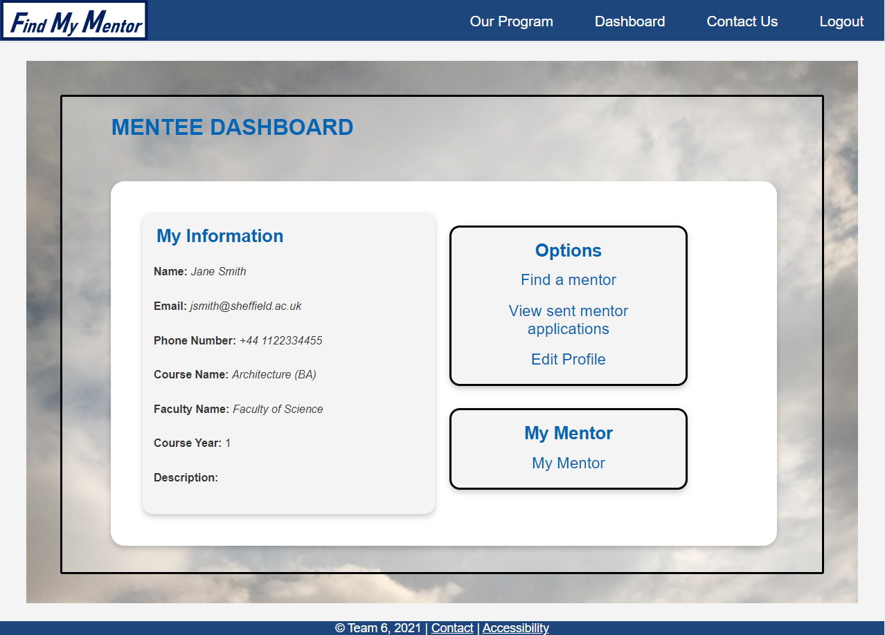

# Mentor-Mentee Matching System

The Mentor-Mentee Matching System is a web application designed to securely match university students (mentees) with mentors in their relevant subjects. This application is developed using Ruby, Sinatra, SQLite 3, among other technologies.

## Tech Stack

- Ruby
- Sinatra
- SQLite 3
- Capybara
- Rack-test
- Require_all
- RSpec
- Sequel
- SimpleCov
- Thin
- Sinatra-contrib

## Setup Guide

**Note:** All commands are presented in `"quotes"`, remove these when running the command.

### Accessing the Project Directory

From the terminal, use `cd project` to access the project directory, e.g. `cd ~workspace/project`.

### Database Setup

1. In the terminal, use `cd db` to access the database directory.
2. Enter the following commands into the terminal (in order):
    ```bash
    sqlite3 production.sqlite3
    .read tables.sql
    .schema
    ```
    Use `ctrl+z` to exit SQLite form.
3. Use `select * from tableName` where tableName is the table name in `tables.sql` (visible with `.schema` command), e.g. `select * from mentees;`.
4. Use `delete * from tableName` to clear a table where tableName is the table name in `tables.sql`, e.g. `delete * from requests;`.
5. Use `cd ..` to exit the directory.

### Running the Web Application

1. Install gems by typing `bundle install` in the terminal.
2. Type `ruby app.rb` to start up the website on the webserver.
3. Open a browser and navigate to `https://<codio_box_name>-<port_number>.codio.io/`. The `<codio_box_name>` and `<port_number>` are available in your terminal once you run `app.rb`.
4. Press `CTRL+C` in the terminal to stop the webserver.
    - **Important:** Make sure the requests table is empty before you run the webserver.

### Login Credentials

To log in to our website use the following username and password combinations:

- mentee1 : mentee1
- mentee2 : mentee2
- mentor1 : mentor1
- mentor2 : mentor2

### Running Rspec Tests

1. To run a specific test make sure you're in the project directory and run `rspec spec/features/test-file` or `rspec spec/unit/test-file` where `test-file` is the test you want to run, e.g. `edit_spec.rb`.
2. To run all tests, simply run `rspec` or `rspec spec`.
    - **Note:** The tests will make changes to the database so the database should be returned to its previous state after running all of the tests. This can be done using `git checkout db/testing.sqlite3`.

## Contributors

- [Samiha Fansur](https://github.com/SamihaFansur)
- [Euan Goodbrand](https://github.com/euangoodbrand)
